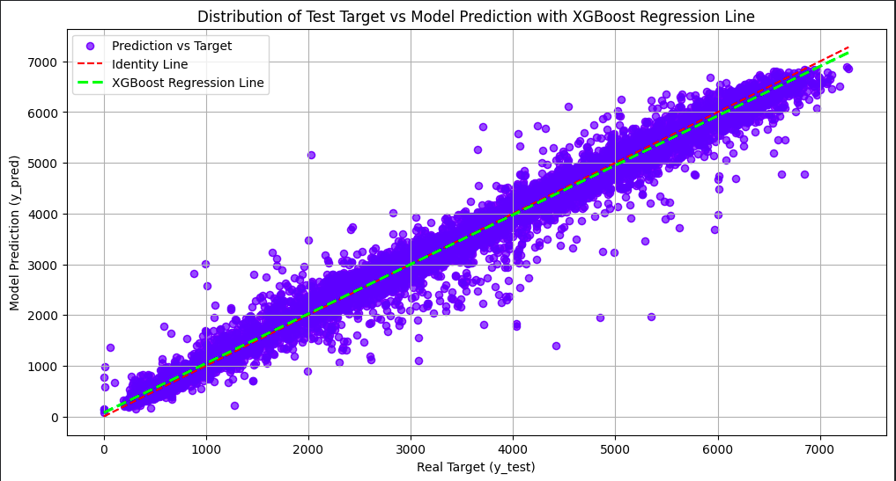

# Traffic Volume Prediction Project

This repository contains a mini-project focused on predicting traffic volume using both **Linear Regression** and **XGBoost Regression** models. The aim is to compare the performance of these models based on the R² score to determine which model better captures the patterns in the traffic data. This project is part of a bootcamp conducted by **ISE! Academy Intermediate Level**, an annual event organized by the Department of Information Systems at ITS.

## Table of Contents
- [Introduction](#introduction)
- [Dataset](#dataset)
- [Features](#features)
- [Models](#models)
  - [Linear Regression](#linear-regression)
  - [XGBoost Regressor](#xgboost-regressor)
- [Evaluation](#evaluation)
- [Results](#results)
- [Conclusion](#conclusion)
- [How to Run](#how-to-run)
- [Dependencies](#dependencies)

## Introduction

Accurately predicting traffic volume can help improve traffic management and provide useful insights for urban planning. This project utilizes machine learning techniques to predict traffic volume using weather conditions and other time-based features. We compare two regression models: **Linear Regression**, a simple but interpretable model, and **XGBoost Regressor**, a more advanced and powerful model.

## Dataset

The [dataset](https://www.kaggle.com/datasets/anshtanwar/metro-interstate-traffic-volume) from kaggle by anshtanwar contains various features related to weather and time, which are used as predictors for traffic volume. Below are some key features used in this project:

- **traffic_volume**: The target variable representing the traffic volume (int64)
- **holiday**: Indicates whether the day is a holiday (object)
- **temp**: Temperature in Kelvin (float64)
- **rain_1h**: Amount of rain in the last hour (float64)
- **snow_1h**: Amount of snow in the last hour (float64)
- **clouds_all**: Cloudiness percentage (int64)
- **weather_main**: Main weather condition (object)
- **weather_description**: Detailed weather condition (object)
- **date_time**: a datetime variable that shows the hour of the data collected in local CST time.


Additional features were created such as cumulative, lag, rolling statistics, and categorical encodings to enhance the model's predictive power.

## Features

The following features were extracted or engineered to enhance the models' performance:
- **hour**: Hour of the day (0-23)
- **day_of_week**: Day of the week (0-6)
- **is_weekend**: Boolean indicating if the day is a weekend
- **cloud_categories**: Categorical variable based on cloud cover percentage
- **is_weekend_and_holiday**: Boolean indicating whether the day is both a weekend and a holiday
- **is_precipitation**: Boolean indicating the presence of rain or snow

## Models

### Linear Regression

Linear Regression is a basic model that assumes a linear relationship between the input features and the target variable (traffic volume). While simple, it can provide useful insights and set a baseline for more advanced models.

### XGBoost Regressor

XGBoost Regressor is an implementation of gradient boosting tailored for performance and speed. It often outperforms simpler models like Linear Regression by handling complex patterns in the data.

**Hyperparameters** used for tuning the XGBoost Regressor include:
- `learning_rate`: [0.001, 0.005, 0.01, 0.05, 0.1, 0.2]
- `max_depth`: [3, 5, 7, 9, 11]
- `subsample`: [0.5, 0.6, 0.7, 0.8, 0.9, 1.0]
- `colsample_bytree`: [0.5, 0.6, 0.7, 0.8, 0.9, 1.0]
- `min_child_weight`: [1, 2, 3, 4, 5]

A **Manual Best Parameter Search** was used to identify the best hyperparameters for the XGBoost model.

## Evaluation

To evaluate the models' performance, we used the following metrics:
- **Mean Squared Error (MSE)**: Measures the average squared difference between the predicted and actual values.
- **R² Score**: Represents the proportion of variance in the dependent variable that is predictable from the independent variables.

## Results

The performance of the two models was compared based on their R² scores:

- **Linear Regression**: R² Score = `0.84128`
- **XGBoost Regressor**: R² Score = `0.98082`

The XGBoost model significantly outperformed the Linear Regression model due to its ability to capture more complex relationships in the data.

### **Comparation between Linear Regression Graph and XGBoost Regressor Graph**

- **Linear Regression**


- **XGBoost Regression**



## Conclusion

Through this mini-project, we will demonstrate the effectiveness of different models for predicting traffic volume and provide insights into how feature engineering and model tuning can impact performance.

The **XGBoost Regressor** provided a much better fit to the data compared to **Linear Regression**, with a higher R² score and better generalization on unseen data. This suggests that for this specific traffic volume prediction problem, a more complex model like XGBoost is more suitable.

## How to Run

1. Clone the repository:
   ```bash
   git clone https://github.com/yourusername/traffic-volume-prediction.git
   cd traffic-volume-prediction
   ```

2. Install the required dependencies:
    ```bash
    pip install -r requirements.txt
    ```

3. Open VS Code to run the notebook

## Dependencies

The project requires the following Python libraries:

- pandas
- numpy
- scikit-learn
- xgboost
- matplotlib

These can be installed via the provided `requirements.txt` file.

This project is part of the bootcamp conducted by ISE! Academy, an annual event organized by the Department of Information Systems at ITS.
